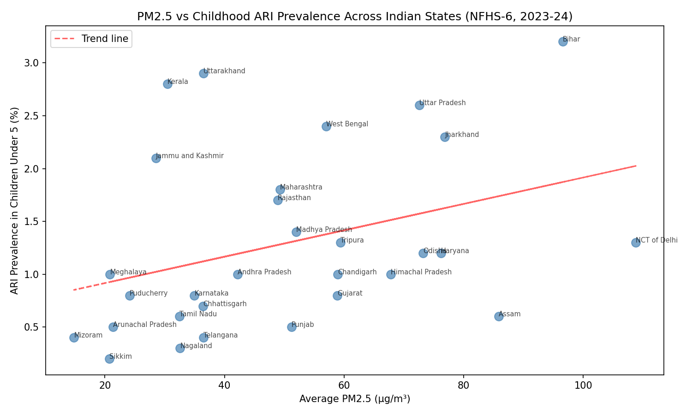

Project: Air Quality and Respiratory Health in India — An EDA
Objective: Examine whether state-level outdoor air pollution (PM2.5) correlates with childhood respiratory illness (ARI) prevalence in India, using CPCB monitoring data (2010-2023, 442 stations) merged with NFHS-6 (2023-24) national health survey data across 30 states.
Key Finding: PM2.5 shows only a weak positive correlation (r = 0.35) with childhood ARI prevalence — meaning ambient air pollution alone explains roughly 12% of the variation in respiratory illness across states. This challenges the common assumption that high-pollution states/cities automatically show worse respiratory health outcomes.

Notable outliers:
NCT of Delhi — highest PM2.5 in the dataset (108.8 µg/m³) but relatively low ARI (1.3%)
Kerala — comparatively low PM2.5 (30.4 µg/m³) but among the highest ARI (2.8%)
Bihar — the one state where the assumption holds: high PM2.5 (95.6) and highest ARI (3.2%)

Interpretation: Outdoor ambient pollution is likely not the dominant driver of childhood respiratory illness at a state level. Other factors — indoor air pollution from solid cooking fuel use, healthcare access and diagnosis/reporting differences, humidity and climate, population density, and nutrition/immunity — likely play a larger combined role than outdoor AQI alone.

Limitations (stated explicitly):
AQI aggregated from city/station level up to state level, which masks intra-state variation
Station count per state is uneven (ranging from 1 to 56 stations) — states with fewer stations have less reliable averages
NFHS-6 excluded Manipur; 5 small UTs had no matching AQI stations, reducing final sample to 30 states
Correlation does not imply causation; no controls for confounding variables (population density, income, healthcare access)

